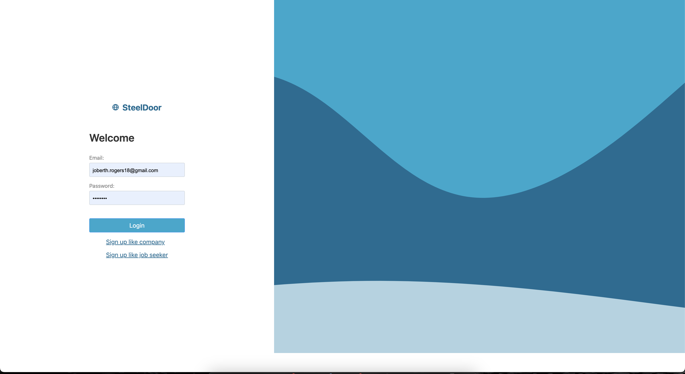
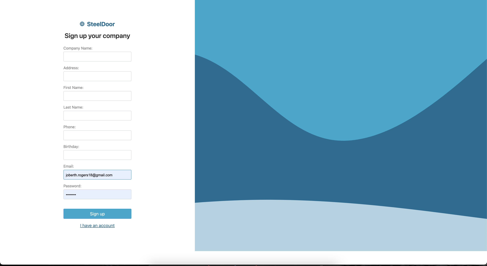
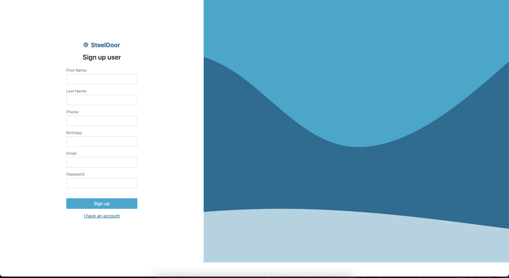
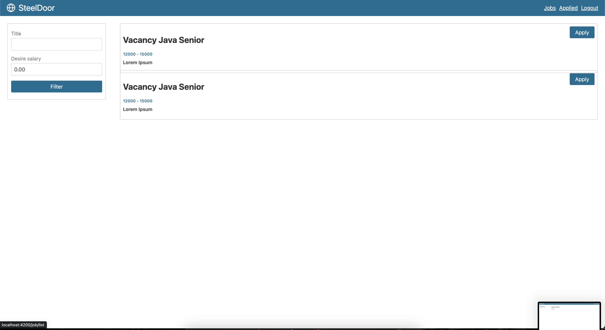
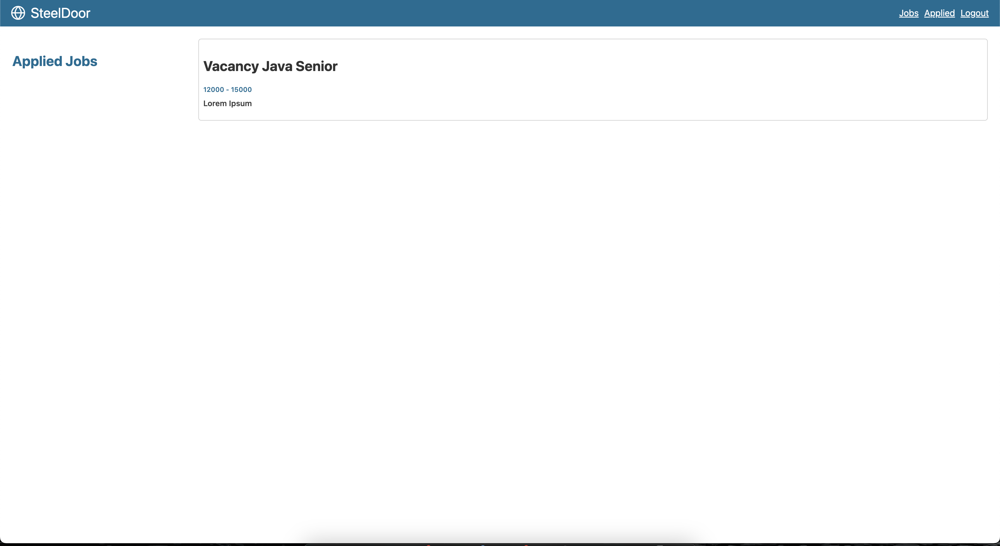
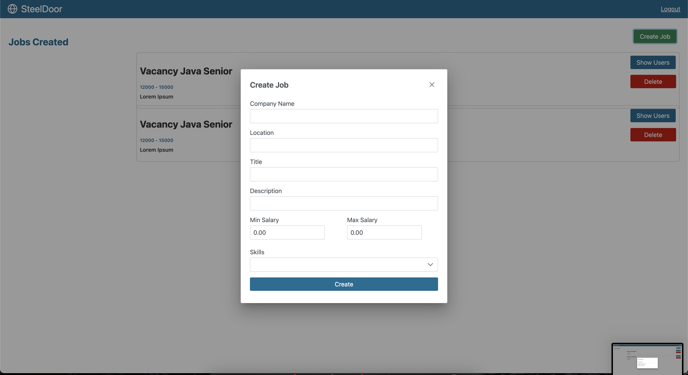
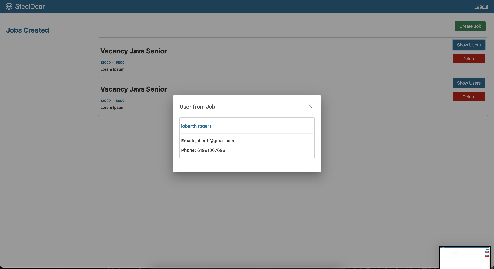

# SteelDoor

## 1. Summary

This repository contain all the code from challenge Steeldoor, this repository is separated in api and frontend directories. I've use docker and docker compose to manipulate dependencies. The frontend is made in Angular Framework (Javascript), and backend in Spring Boot (Java).

**OBS:** To jump to install instructions use this [Link](#3-installation)

## 2. Screens

### 2.1 Logins


### 2.2 SignUp

#### 2.2.1 Company


#### 2.2.2 User


### 2.3 Job Seeker Area
#### 2.3.1 List jobs

#### 2.3.2 Jobs Applied


### 2.4 Company Area
#### 2.3.1 Create Jobs

#### 2.3.2 Users by job



## 3. Installation

To start installation you need to the follow dependencies:

- [Docker](https://docs.docker.com/engine/install/)
- [Docker compose](https://docs.docker.com/compose/install/)

After download and install the dependecies above, user the follow command:

```
docker-compose up --build
```

This running take a little while, so wait until front end container start and say that is running an ready in host **http://localhost:4200**

Now just start to play with application.
